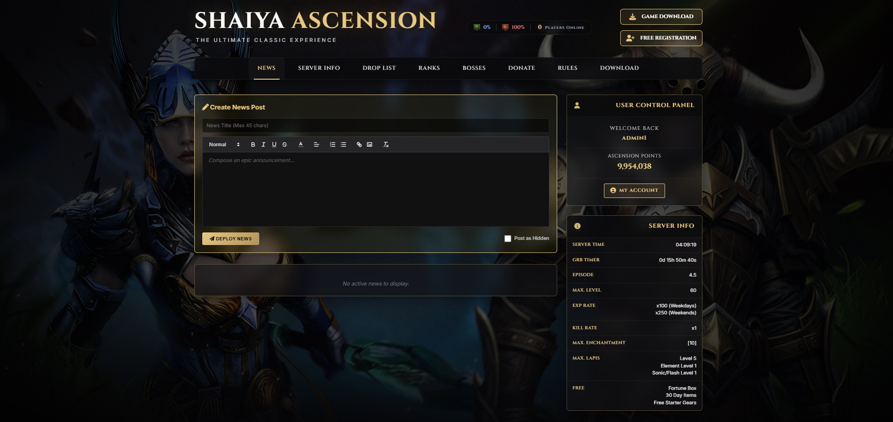
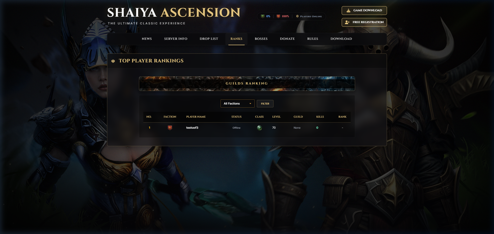
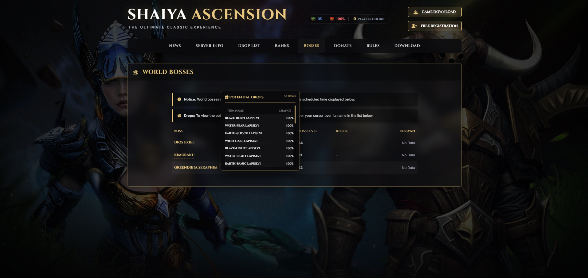
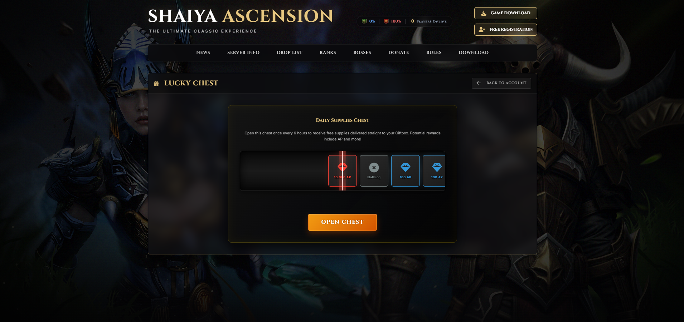
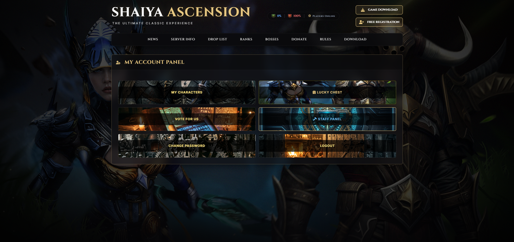
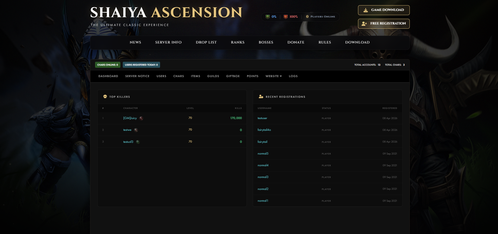

<p align="center">
  
</p>

<h1 align="center">Shaiya Website</h1>

<p align="center">
  <strong>A full-featured community website and admin panel for the Shaiya private server.</strong><br>
  Built with PHP, MSSQL (ODBC), and vanilla CSS - designed for Shaiya servers.
</p>


> [!CAUTION]
> **⚠️ AI-Generated Code Disclaimer**
>
> Approximately **60% of this project's codebase was generated with the assistance of AI**. While functional, the code **contains known and potential security vulnerabilities** - including but not limited to lack of CSRF protection, plaintext password storage (Shaiya engine limitation), and some unsanitized query patterns in admin-only contexts.
>
> **This project is NOT recommended for production use** without a thorough security audit. Use at your own risk. If you choose to deploy this publicly, you are responsible for identifying and patching all vulnerabilities.
>
> This website was made for the **Shaiya community as a base project** - feel free to fork it, build on top of it, and develop it further to fit your server's needs.

<p align="center">
  <a href="https://discord.gg/nkk56ucJzk">
    
  </a>
</p>

---

## 📸 Screenshots (Click on image to enlarge)

| Homepage | Rankings |
|----------|-------------|
|  |  |

| World Bosses | Lucky Chest |
|----------|-------------|
|  |  |

| My Account | Staff Panel |
|----------|-------------|
|  |  |

---

## 📖 Table of Contents

- [Overview](#overview)
- [Features](#features)
- [Database Requirements](#database-requirements)
- [Installation & Setup](#installation--setup)
- [Configuration](#configuration)
- [Page Reference](#page-reference)
- [Admin Panel](#admin-panel)
- [Security Notes](#security-notes)

---

## Overview

Shaiya Web Portal is the community-facing website for the **Shaiya** private server. It provides everything players need - from registration and news to advanced drop lookups and live boss timers - along with a comprehensive staff admin panel for server management.

The site connects directly to the Shaiya game database (`PS_UserData`, `PS_GameData`, `PS_GameDefs`, `PS_GameLog`) via ODBC, making all data live and real-time.

> [!IMPORTANT]
> For the **Server Notice** and **Kick** features to work, you need to follow this tutorial:
> [Release - Call PSMAgent Commands via SQL](https://www.elitepvpers.com/forum/shaiya-pserver-guides-releases/3596037-release-call-psmagent-commands-via-sql.html). Without it, those features will not function.

---

---

## Features

### 🏠 Public Pages
| Page | Description |
|------|-------------|
| **News Feed** | Dynamic news system with WYSIWYG editor (Quill.js), image uploads, hidden drafts, and CRUD operations for staff |
| **Server Info** | Tabbed interface with core gameplay details, enchantment rate tables (weapon & armor), and instance info |
| **Drop Finder** | Search engine for item drops - search by item or monster name, view drop rates, mob locations with minimap tooltips, and paginated results |
| **Rankings** | Top player rankings with faction filters (AOL/UOF/Online), class icons, rank badges, guild affiliations, and pagination |
| **Guild Rankings** | Side-by-side faction guild leaderboards (Top 20 per faction) with points, members, and leader info |
| **Bosses** | Live world boss tracker with respawn countdown timers, last killer info, and hoverable drop table tooltips |
| **Donate** | Donation packages with PayPal/Revolut methods, bonus item tooltips, and selectable tiers |
| **Rules** | Complete Terms of Service and Code of Conduct |
| **Download** | Game client download links (Google Drive, Official Mirror, Mega) with system requirements - links configurable via admin |
| **Registration** | Account creation with math captcha, email validation (max 3 accounts per email), configurable on/off toggle |

### 👤 User Account Panel
| Feature | Description |
|---------|-------------|
| **My Characters** | View all active and deleted characters with faction, class, level, kills, map location, and creation date |
| **Character Deletion** | Soft-delete characters (requires being logged out of the game) |
| **Character Resurrection** | Restore deleted characters for 50 Shaiya Points |
| **Lucky Chest** | Roulette-style reward system with 6-hour cooldown - awards AP directly to the player's Giftbox |
| **Change Password** | Secure password change with current password verification |
| **Vote For Us** | Placeholder for voting integration |

### 🔨 Admin Panel (Staff Only)
| Module | Description |
|--------|-------------|
| **Dashboard** | Server stats overview - online count, daily registrations, total accounts/chars, top killers, recent registrations |
| **Server Notice** | Send live in-game announcements via the game server's command system |
| **Users Management** | Search, view, edit user accounts - change status, password, kick users, view point history |
| **Characters Management** | Full character editor - rename, change level/map, send gold, manage inventory with item stats/gems, kick/delete/restore |
| **Items Browser** | Browse the game's item database |
| **Guilds Management** | Guild overview, member list, warehouse inspection, rename guilds, change leaders, delete guild warehouse items |
| **Giftbox** | Send items directly to any player's Giftbox by UserID or CharName |
| **Points Management** | Add Shaiya Points to accounts with reason logging and audit trail |
| **Website Settings** | Toggle registration, configure downloads, manage drop finder settings and item blacklists, toggle Lucky Chest |
| **Action Logs** | View game server action logs (item drops, trades, etc.) with character restoration capability |
| **Permissions Management** | Granular permission system - ADM (Status 16) controls which admin sections GM (32) and GMA (48) can access |

### 📊 Live Features
- **Faction balance bar** in header showing AOL vs UOF percentages
- **Live player online count** in header
- **Boss respawn timers** with live JavaScript countdown

---

## Database Requirements

This project uses the **default Shaiya database structure** - the standard `PS_UserData`, `PS_GameData`, `PS_GameDefs`, and `PS_GameLog` databases that come with any Shaiya server setup. No modifications to the existing game databases are required.

The website also auto-creates a few additional tables for its own functionality. These are listed below:

| Table | Created By | Purpose |
|-------|-----------|---------|
| `Web_News` | `news_handler.php` | Stores news articles |
| `Web_PointHistory` | `db.php` | Audit trail for point additions |
| `Web_LuckyCase` | `lucky_case_api.php` | Tracks lucky chest cooldowns |
| `Web_Settings` | `admin_actions.php` | Key-value store for all website configuration |

---

## Installation & Setup

Copy the files to your web server and configure the database connection by editing `db.php` and `db_pdo.php`:

```php
$db_host = 'YOUR_SQL_SERVER_IP';
$db_user = 'YOUR_SQL_USERNAME';
$db_pass = 'YOUR_SQL_PASSWORD';
$db_name = 'PS_UserData';
```

Template files (`db.example.php` and `db_pdo.example.php`) are included in the repo for reference.

---

## Configuration

All runtime configuration is stored in the `Web_Settings` database table and managed through the admin panel. No config files need to be edited after initial setup.

| Setting Key | Default | Description |
|------------|---------|-------------|
| `RegistrationEnabled` | `1` | Enable/disable account registration |
| `DownloadsEnabled` | `1` | Enable/disable download page |
| `Link_GoogleDrive` | *(empty)* | Google Drive download URL |
| `Link_OfficialMirror` | *(empty)* | Official mirror download URL |
| `Link_Mega` | *(empty)* | Mega.nz download URL |
| `LuckyChestEnabled` | `1` | Enable/disable Lucky Chest feature |
| `DropsMaxGrade` | `3072` | Maximum item grade shown in Drop Finder |
| `DropsMaxLevel` | `80` | Maximum item level shown in Drop Finder |
| `DropsHideZero` | `1` | Hide items with 0% drop rate |
| `DropsHideEmpty` | `1` | Hide items that no monster drops |
| `DropsBlacklist` | *(comma-separated IDs)* | Item IDs hidden from Drop Finder |
| `GM_Permissions` | `[]` | JSON array of admin sections accessible by GM (Status 32) |
| `GMA_Permissions` | `[]` | JSON array of admin sections accessible by GMA (Status 48) |

---

## Page Reference

### Navigation
The main navigation includes: **News** → **Server Info** → **Drop List** → **Ranks** → **Bosses** → **Donate** → **Rules** → **Download**

### Authentication
- Login is handled via the sidebar on the homepage (`index.php`)
- Sessions are PHP native (`$_SESSION['user']`)
- Admin access requires `Status` field values: `16` (ADM), `32` (GM), or `48` (GMA)
- Account status `16` has full admin access; `32` and `48` have configurable permissions

### Timezone
The server operates on **Europe/Sofia** timezone (UTC+2 / UTC+3 DST). This is set in `db.php` via `date_default_timezone_set()`.

---

## Admin Panel

The admin panel is accessible at `admin.php` for users with Status 16, 32, or 48.

### Access Levels

| Status | Role | Access |
|--------|------|--------|
| `16` | **ADM** (Administrator) | Full access to all sections + permission management |
| `32` | **GM** (Game Master) | Access controlled via Permissions Management |
| `48` | **GMA** (Game Master Assistant) | Access controlled via Permissions Management |

### Admin Views

| View | URL Parameter | Description |
|------|--------------|-------------|
| Dashboard | `?view=Dashboard` | Overview with stats, top killers, recent registrations |
| Server Notice | `?view=send_notice` | Send in-game notice announcements |
| Users | `?view=Users` | User search and management |
| UserEdit | `?view=UserEdit&uid=X` | Individual user editing (status, password, kick, characters, warehouse, point history) |
| Chars | `?view=Chars` | Character search and management |
| CharEdit | `?view=CharEdit&id=X` | Individual character editing (rename, level, map, gold, inventory, kick/delete/restore) |
| Items | `?view=Items` | Game item browser |
| Guilds | `?view=Guilds` | Guild search |
| Guild Overview | `?view=GUILD_OVERVIEW&id=X` | Guild details, members, warehouse |
| Giftbox | `?view=Giftbox` | Send items to player Giftbox |
| Points | `?view=Points` | Add Shaiya Points |
| Drops Blacklist | `?view=drops_blacklist_add` | Manage Drop Finder blacklist |
| Lucky Chest | `?view=luckychest_toggle` | Toggle Lucky Chest and reset timers |
| Downloads | `?view=downloads_update` | Manage download links |
| Registration | `?view=register_toggle` | Toggle registration |
| Permissions | `?view=permissions_management` | Configure GM/GMA access |
| Action Logs | `?view=ActionLog` | View game server logs |

---

## Security Notes

> ⚠️ **This project is designed for private server use within a trusted network.** Review these points before any public deployment.

- **Passwords** are stored and compared in plaintext (as is standard for Shaiya's `Users_Master` table). The website does not add its own hashing layer since it must remain compatible with the game client.
- **SQL Injection**: Most queries use parameterized statements (`odbc_prepare` + `odbc_execute`). A few admin-only queries use string interpolation - these are behind strict status checks.
- **Session Security**: Sessions use PHP's native session handler. Consider adding `session_regenerate_id()` on login and setting secure cookie flags for production.
- **File Uploads**: News image uploads are restricted to PNG, JPG, and WebP formats with MIME type validation.
- **CSRF**: Forms do not currently implement CSRF tokens. Consider adding them for production.
- **Database Credentials**: Remember to update `db.php` and `db_pdo.php` with your own credentials before deploying. **Never commit real credentials to a public repository.**

<p align="center">
  <sub>Built with ☕ and dedication</sub>
</p>
